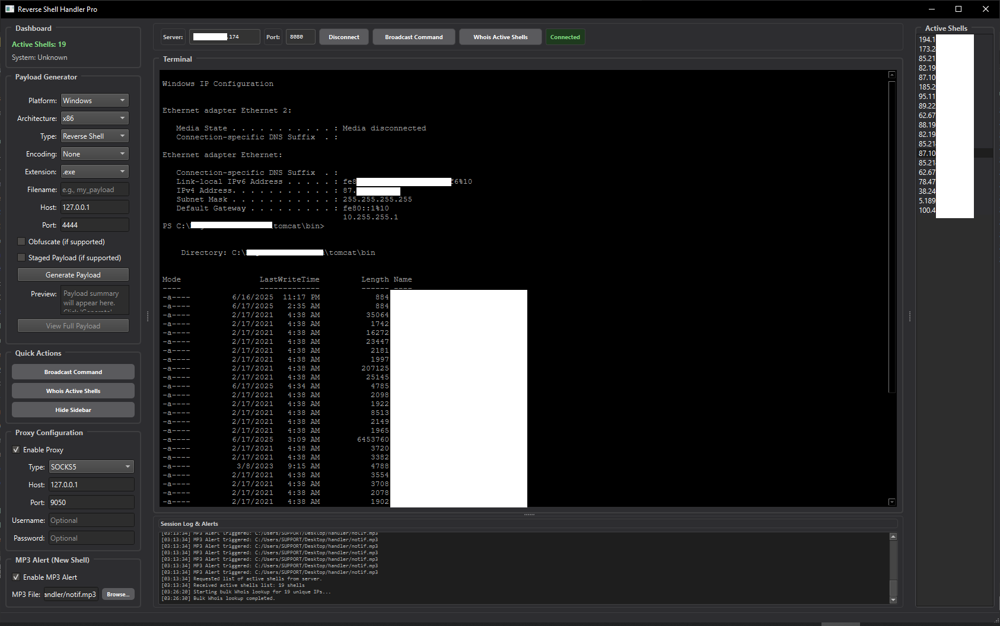
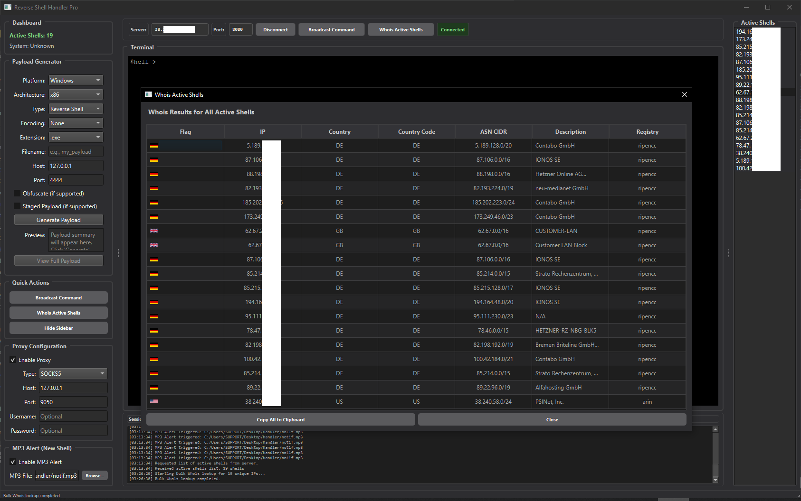

<!-- Reverse Shell Handler Pro — README section (HTML-friendly for GitHub) -->

<h1 align="center">Reverse Shell Handler</h1>

  <em>PyQt6 Client GUI to receive, visualize and control remote shells, with ANSI terminal, payload generator, bulk Whois, proxy and alerts.</em>

  
  
  

<h2>✨ Highlights</h2>
<ul>
  <li><strong>Modern PyQt6 interface</strong> with animated side panel, dashboard and tabbed terminal stack per session (<code>QSplitter</code>, <code>QStackedWidget</code>). <!-- UI layout -->
  </li>
  <li><strong>PuTTY-like terminal</strong>:
    <ul>
      <li>Protected prompt (<code>$hell ></code>), editing blocked before prompt, paste on right click.</li>
      <li><strong>ANSI 16/256 color rendering</strong>, bold/italic, inverse, and extended xterm colors (38/48; 24-bit mapped). <!-- ANSI rendering -->
      </li>
      <li>CR/LF cleanup and automatic line break insertion.</li>
    </ul>
  </li>
  <li><strong>Multi-shell management</strong>: list of active connections, dedicated terminal per shell, instant switch, clean close on disconnect. Initial active shell request sent to server upon connection.</li>
  <li><strong>Automatic reconnection</strong> with timer, timestamped event log and alert zone.</li>
  <li><strong>Integrated proxy (PySocks)</strong>: SOCKS5/SOCKS4/HTTP with optional authentication and adaptive timeouts. Toggle from UI, persistent in config.</li>
  <li><strong>MP3 alerts (pygame)</strong>: play MP3 file on new event (toggleable, file selectable from UI).</li>
  <li><strong>Whois</strong>:
    <ul>
      <li>Whois lookup for an active IP (dedicated window with ASN, registry, nets, raw data).</li>
      <li><strong>Bulk Whois</strong> for all unique active IPs in a dedicated thread; tabular display (IP, country code, ASN CIDR, registry, description), with one-click copy.</li>
    </ul>
  </li>
  <li><strong>Payload generator</strong>:
    <ul>
      <li>Platforms: Windows, Linux, macOS, Android, PHP, Python, Bash.</li>
      <li>Types: Reverse/Bind shell, Meterpreter, Web shell, Empire (PS).</li>
      <li>Encodings: None, Base64, Hex, URL, <code>powershell -enc</code> (UTF-16LE compliant for PS).</li>
      <li>Brief preview + <em>View Full Payload</em> window for complete code.</li>
    </ul>
  </li>
  <li><strong>Persistent preferences</strong>: host/port, auto-connect, proxy, MP3 file, etc. (<code>ReverseShellHandler.conf</code>).</li>
</ul>

<h2>🧱 Architecture &amp; Components</h2>
<ul>
  <li><code>ReverseShellClient</code> (QMainWindow): socket handling, message queue, signals (new shell, output, disconnect, status), UI and persistence.</li>
  <li><code>TerminalWidget</code>: <code>QTextEdit</code> styled monospace + custom ANSI parser (SGR, 8/16/256 colors), protected prompt, command input via signal.</li>
  <li><code>PayloadGeneratorWidget</code>: forms (platform, arch, type, encoding, extension, name), snippet generation (simplified msfvenom, PS/Bash).</li>
  <li><code>BulkWhoisThread</code> + Whois windows: IPWhois queries in thread, extensible results table (clipboard copy, flags if available).</li>
  <li>Proxy/MP3 options: dedicated groups, validated fields, disabled if library missing.</li>
</ul>

<h2>⚙️ Optional Dependencies</h2>
<ul>
  <li><strong>PySocks</strong> (proxy) — proxy UI disabled if not installed.</li>
  <li><strong>pygame</strong> (MP3 alerts) — alerts disabled if not installed.</li>
  <li><strong>ipwhois</strong> (Whois) — Whois features disabled if missing.</li>
  <li><strong>requests</strong> (country flags in Whois table) — optional.</li>
</ul>

<h2>🚀 Launch the Application</h2>
<pre><code>python ReverseShellHandler.py [server_host] [server_port]
# Example: python ReverseShellHandler.py 127.0.0.1 5555
</code></pre>

On first connection, the UI saves your settings (auto-connect enabled); a timer takes over in case of disconnection (cyclic reconnection).

<h2>🖥️ Terminal &amp; Commands</h2>
<ul>
  <li>Each shell opens a dedicated terminal; output is routed and rendered with color.</li>
  <li>Sets of <em>predefined commands</em> per OS are provided (network/system), and custom command sending is available via dialog box.</li>
</ul>

<h2>🔐 Legal Disclaimer</h2>

This project is provided <strong>strictly for testing in controlled environments</strong> and for learning purposes. The author and contributors disclaim all liability for illegal or unauthorized use. Ensure you have explicit authorization from targeted systems.

<h2>📁 Configuration</h2>
<ul>
  <li><code>ReverseShellHandler.conf</code>: host/port, auto-connect, Proxy (type/host/port/user/pass), MP3 (enabled + path).</li>
</ul>

<h2>🧩 Payload Generator — Examples (summary)</h2>
<ul>
  <li><strong>Windows / Reverse Shell (PowerShell)</strong> — one-liner PS non-interactive with read/write loop and current prompt echo.</li>
  <li><strong>Linux / Meterpreter</strong> — <code>msfvenom</code> calls targeted by arch (x86/x64/ARM/AArch64) for ELF.</li>
  <li><strong>Bash</strong> — classic <code>/dev/tcp</code> redirections.</li>
  <li><strong>PS Encoding</strong> — <code>-enc</code> in UTF-16LE on command part, PowerShell compliant.</li>
</ul>

<h2>📸 Screenshots</h2>

  
    
  

<h1 align="center">🖥️ Reverse Shell Server Agent</h1>

  <em>Python server accepting reverse shell connections and communicating with the GUI interface.</em>

<h2>⚙️ Features</h2>
<ul>
  <li><strong>Reverse shell</strong> listener on a dedicated port.</li>
  <li><strong>GUI client</strong> listener on another port.</li>
  <li>Multi-client management with threads and message queue.</li>
  <li><code>--install</code> option to automatically deploy the server as a <strong>systemd service</strong> at startup.</li>
  <li>Process name masking (via <code>setproctitle</code> if available).</li>
</ul>

<h2>🔌 Ports</h2>
<ul>
  <li><strong>Shell Port</strong> (default <code>990</code>) → receives reverse shell connections.</li>
  <li><strong>GUI Port</strong> (default <code>8080</code>) → communication with GUI client.</li>
</ul>

<h2>🚀 Installation &amp; Usage</h2>

<h3>1. Clone the project</h3>
<pre><code>git clone https://github.com/b-L-x/reverseshell-server.git
cd reverseshell-server
</code></pre>

<h3>2. Run the server manually</h3>
<pre><code>python server.py [shell_port] [gui_port]

# Example:
python server.py 990 8080
</code></pre>

<h3>3. Install as systemd service (optional)</h3>
<pre><code>sudo python server.py --install
</code></pre>
<ul>
  <li>Creates a <code>systemd-worker.service</code> in <code>/etc/systemd/system/</code>.</li>
  <li>Starts automatically on boot.</li>
  <li>Useful commands:
    <pre><code>sudo systemctl start systemd-worker
sudo systemctl status systemd-worker
sudo systemctl stop systemd-worker
</code></pre>
  </li>
</ul>

<h2>📋 Quick Example</h2>
<pre><code># Listen on default ports
python server.py

# Listen on custom ports
python server.py 4444 9090
</code></pre>
